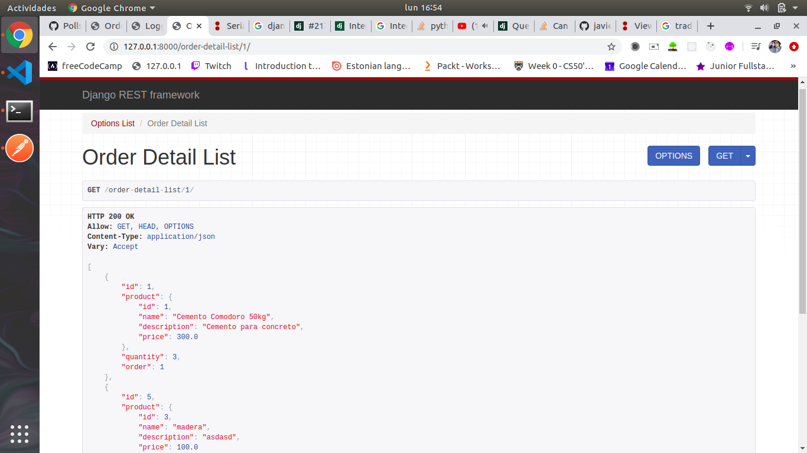
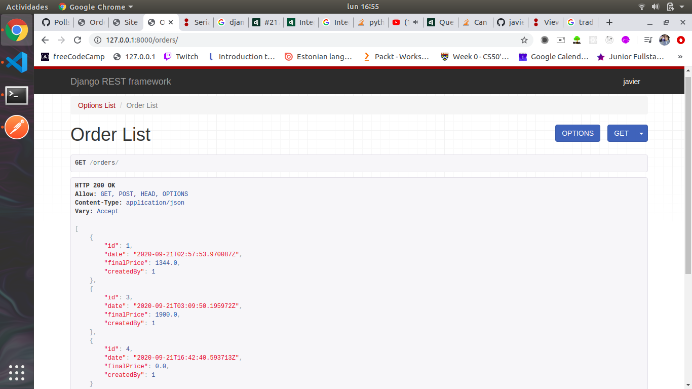

# API simulacion de "Ferreteria"  

API hecha con Django Rest Framework con funcionalidades de CRUD (create, update, delete), autenticacion mediante Token.  
### Descripcion  
Consta de creacion de usuarios (nombre, email y contraseña), login de usuarios el cual retorna un Token que se utiliza para autenticacion en las vistas siguientes.  
Ordenes y descripciones de Ordenes: Cada orden esta creada por un usuario y puede tener muchas "descripciones de orden". Cada descripcion de orden esta asociada a una orden y contiene un producto y su cantidad correspondiente.  

#### Capturas de la aplicacion.  

